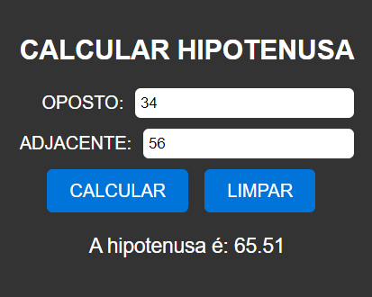

# CALCULAR HIPOTENUSA
🆎CALCULADORA DE HIPOTENUSA EM HTML, CSS E JS.

  

## DESCRIÇÃO:
O objetivo deste projeto é calcular a hipotenusa de um triângulo retângulo com base nos comprimentos dos catetos oposto e adjacente fornecidos. Aqui estão os principais recursos implementados:

1. Calcular Hipotenusa:
   - Ao clicar no botão "CALCULAR", o sistema realiza o cálculo da hipotenusa com base nos valores dos catetos oposto e adjacente fornecidos.
   - O resultado é exibido abaixo do botão de cálculo.

2. Limpar Campos:
   - Ao clicar no botão "LIMPAR", todos os campos de entrada são resetados, incluindo os valores dos catetos e o resultado do cálculo.

## EXECUTANDO O PROJETO:
1. Informar Catetos:
   - Insira o comprimento do cateto oposto no campo "OPOSTO".
   - Insira o comprimento do cateto adjacente no campo "ADJACENTE".

2. Calcular Hipotenusa:
   - Após inserir os comprimentos dos catetos, clique no botão "CALCULAR" para calcular a hipotenusa do triângulo retângulo.

3. Limpar Campos:
   - Se desejar limpar os campos e o resultado do cálculo, clique no botão "LIMPAR". Isso restaurará os campos para seus valores padrão e limpará o resultado do cálculo da hipotenusa.

## NÃO SABE?
- Entendemos que para manipular arquivos em `HTML`, `CSS` e outras linguagens relacionadas, é necessário possuir conhecimento nessas áreas. Para auxiliar nesse aprendizado, oferecemos cursos gratuitos disponíveis:
* [CURSO DE HTML E CSS](https://github.com/VILHALVA/CURSO-DE-HTML-E-CSS)
* [CURSO DE JAVASCRIPT](https://github.com/VILHALVA/CURSO-DE-JAVASCRIPT)
* [CONFIRA MAIS CURSOS](https://github.com/VILHALVA?tab=repositories&q=+topic:CURSO)

## CREDITOS:
- [PROJETO CRIADO PELO VILHALVA](https://github.com/VILHALVA)

